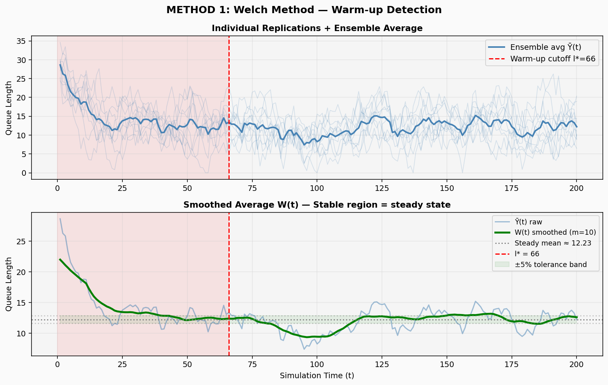
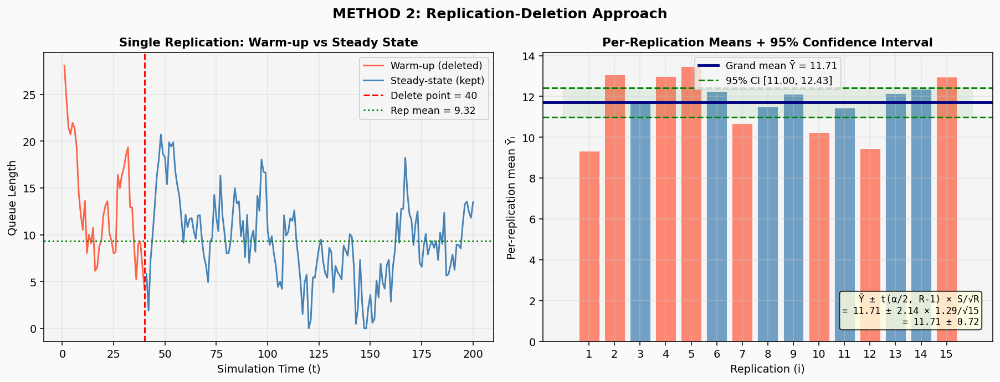
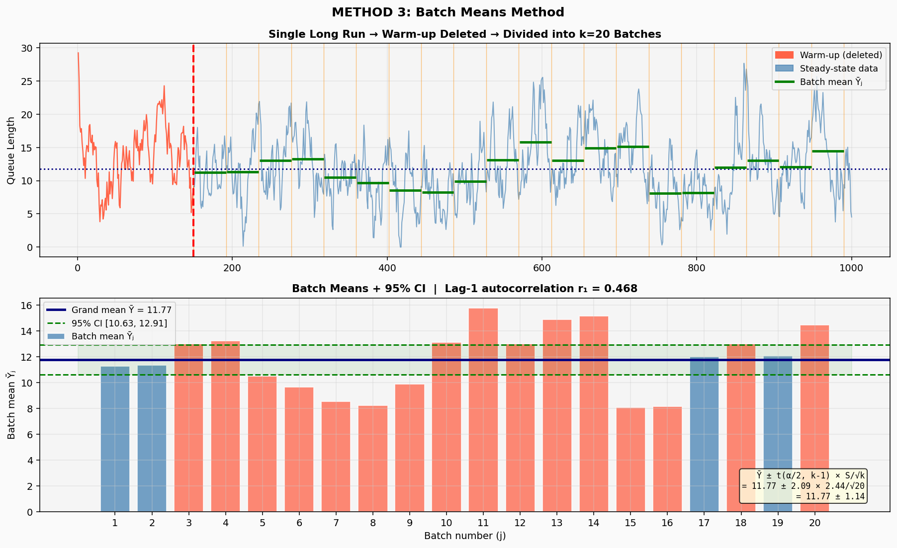
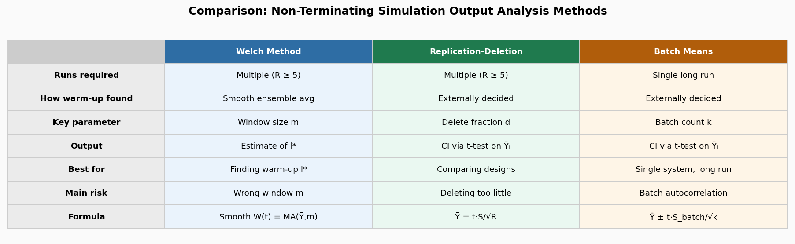

# Output Analysis

## Demo

[Explanation Video](https://drive.google.com/file/d/1uiKu3mMxYz9_gOK87IFGAkIEZxTMdpsP/view?usp=sharing)

## Methods

| # | Method | Approach | Best For |
|---|---|---|---|
| 1 | **Welch Method** | Smooth ensemble avg → detect l\* | Finding warm-up cutoff |
| 2 | **Replication-Deletion** | Multiple runs, delete warm-up fraction | Comparing designs |
| 3 | **Batch Means** | Single long run divided into k batches | Single system analysis |

---

## Results

All three methods converge on a steady-state queue length near **≈ 12 customers**.

| Method | Mean | 95% CI |
|---|---|---|
| Welch Method | 12.23 | — *(diagnostic only)* |
| Replication-Deletion | 11.71 | [11.00, 12.43] |
| Batch Means | 11.77 | [10.63, 12.91] |

## Output Charts

| Image | Description |
|-------|-------------|
|  | Ensemble average + W(t) smoother, warm-up cutoff l* = 66 |
|  | Per-replication means and 95% CI |
|  | Batch divisions, batch means, and 95% CI |
|  | Side-by-side method comparison |

## Setup

```bash
git clone https://github.com/saintpeas/OutputAnalysisPT.git
pip install numpy matplotlib scipy
python simulation_output_analysis.py
```

---

## Stack


---
